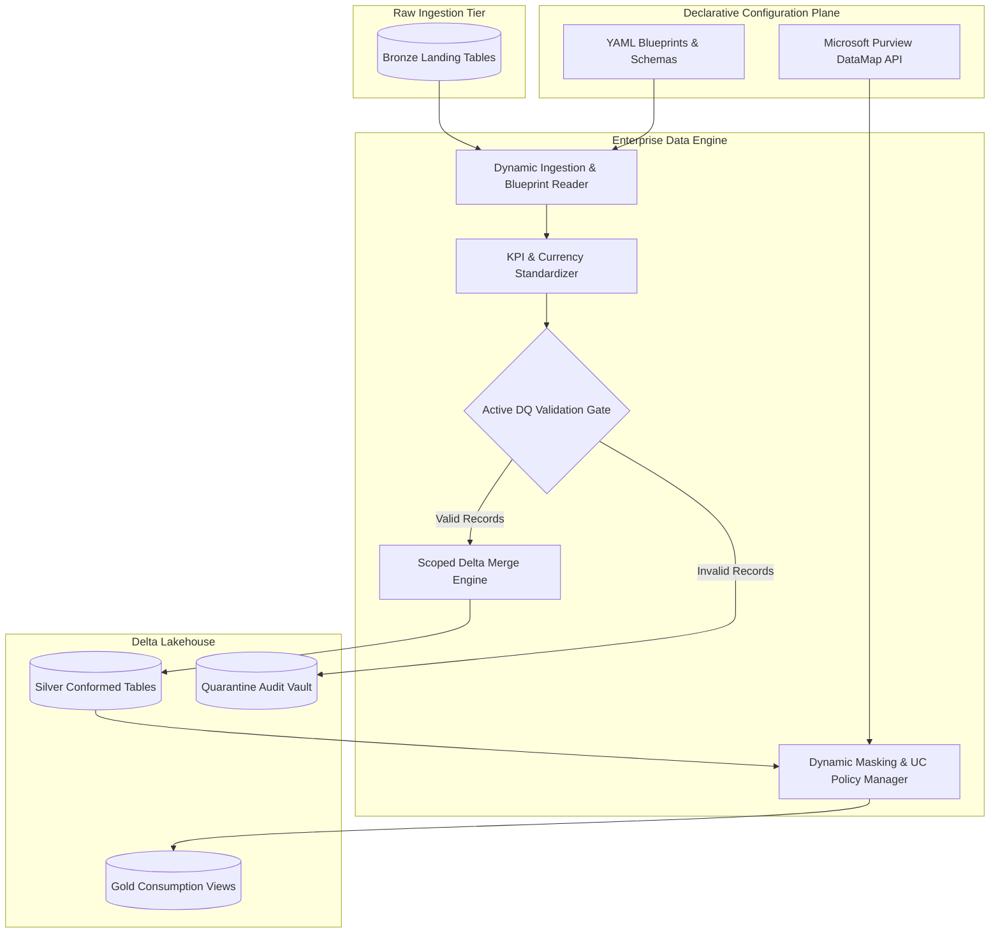

# Enterprise Data Engine

A production-grade, metadata-driven data platform framework built on **PySpark**, **Delta Lake**, and **Databricks Asset Bundles (DABs)**. Engineered to replace brittle, notebook-based workflows with modular software engineering practices: declarative configuration management, automated data quality quarantine routing, native Unity Catalog security policies, and zero-downtime CI/CD deployment gates.

---

## Key Capabilities

* **Metadata-Driven Ingestion & Modeling:** Decouples orchestration logic from dataset schemas. Tables, joins, derivations, and projections are declared via YAML blueprints.
* **Unified Scope-Aware Delta Merge Engine:** Standardizes `RELOAD`, `UPSERT`, and `APPEND` writes with partition-level scoping, schema conformance, and idempotency guarantees.
* **Active Quality Quarantine Gate:** Eliminates passive error logging by inspecting constraints against `system.information_schema` in a single pass. Automatically isolates invalid records into dedicated quarantine tables while routing clean data to target layers.
* **Automated Data Protection & Dynamic Masking:** Programmatically queries classification tags from Microsoft Purview, reconciles active masks across catalogs, and applies column-level encryption (`AES-256`) and dynamic role-based masks (`ALTER TABLE SET MASK`).
* **Automated Schema Lifecycle Waves:** Parses relational schema blueprints to orchestrate parallel DDL provisioning across priority waves (`Dimensions` $\rightarrow$ `Facts` $\rightarrow$ `Views`).
* **Shift-Left CI/CD Automation:** Multi-stage Azure Pipelines and local testing suites that enforce linting (`ruff`), configuration formatting (`pyproject-fmt`), unit testing (`pytest`), and bundle validation before production deployment.

---

## System Architecture


---

## Repository Layout
```text
enterprise-data-engine/
├── .azure-pipelines/
│   ├── enterprise-data-engine-build.yml
│   ├── enterprise-data-engine-pr.yml
│   ├── enterprise-data-engine-push.yml
│   ├── enterprise-data-engine-release-dev.yml
│   ├── enterprise-data-engine-release-prod.yml
│   └── enterprise-data-engine-release-uat.yml
├── .vscode/
│   ├── extensions.json
│   ├── launch.json
│   └── settings.json
├── documents/
├── source/
│   └── data_engine/
│       ├── artifacts/       
│       ├── notebooks/
│       │   ├── .scratch/
│       │   ├── exploratory/
│       │   ├── orchestration/
│       │   │   ├── currency_conversion.ipynb
│       │   │   ├── sample_orchestration.ipynb
│       │   │   └── sample_snapshot.ipynb
│       │   └── utils/
|       |       ├── manage_entities.ipynb
│       │       └── setup_databricks_session.ipynb
│       ├── requirements/
│       │   ├── encryption.txt
│       │   └── log.txt
|       ├── resources/
|       |   ├── alerts/
│       |   │   └── sample.alerts.yml
│       |   ├── jobs/
│       |   │   ├── common_trigger_sample.jobs.yml
│       |   │   ├── job_compute_sample.jobs.yml
│       |   │   ├── manage_entities.jobs.yml
│       |   │   └── serverless_compute_sample.jobs.yml
│       |   ├── targets.yml
│       |   └── variables.yml
│       ├── src/
|       |    ├── config/
│       |    │   ├── blueprints/
│       │    |   │   └── sample_rules.py
│       │    |   └── schemas/
│       │    |       ├── data_engine_dimensions.yml
│       │    |       ├── data_engine_facts.yml
│       │    |       └── data_engine_views.yml
│       │    └── core/
│       │       ├── configs.py
│       │       ├── currency.py
│       │       ├── data_protection.py
│       │       ├── data_quality.py
│       │       ├── databricks_session.py
│       │       ├── engine.py
│       │       ├── helpers.py
│       │       └── version.py
│       ├── tests/
│       │   ├── conftest.py
│       │   ├── test_engine.py
│       │   └── test_quality.py
|       ├── databricks.yml
│       ├── pyproject.toml
│       ├── rebuild.cmd
│       └── run_gates.cmd
├── .gitignore
├── LICENSE
└── README.md
```

---

## Core Framework Modules

* **Unified Scope-Aware Delta Merge Engine (`engine.py`):** Abstract write operations into `scoped_merge_engine` supporting `reload`, `upsert`, and `append` modes. Enforces partition-isolated writes via `whenNotMatchedBySourceDelete(scope)` and applies strict runtime idempotency checks before writing.
* **Active Quarantine Data Quality Gate (`data_quality.py`):** Dynamically extracts Primary Key, Foreign Key, Nullability, and uniqueness rules from ANSI `system.information_schema`. Validates records in a single Spark Catalyst pass and bifurcates the batch into clean targets and an audit quarantine vault without killing cluster execution.
* **Automated Data Protection & Dynamic Masking (`data_protection.py`):** Integrates Microsoft Purview classification tags with live Unity Catalog states. Reconciles schema drift and applies `AES-256` encryption and role-based `ALTER TABLE ALTER COLUMN SET MASK` policies across 17+ SQL types automatically.
* **Parallel Schema Lifecycle Deployment (`engine.py`):** Parses relational DDL specifications from YAML configurations (`data_engine_dimensions.yml, facts.yml, views.yml`). Orchestrates concurrent, non-blocking wave deployments using priority-ranked execution queues (`Dimensions` $\rightarrow$ `Facts` $\rightarrow$ `Views`).  

---

## Local Development & Testing

* **Isolated Virtual Environment Configuration:** Standardizes the runtime on Python 3.11 and Java 17 OpenJDK. Eliminates global package pollution using a dedicated virtual environment with editable package builds (`pip install -e .[dev]`).
* **Pre-Commit Linting & Static Typing:** Enforces strict code hygiene via `ruff check src/` and schema metadata validation via `pyproject-fmt pyproject.toml --check` prior to remote code syncs.
* **Cluster-Agnostic Unit Testing:** Executes localized PySpark test suites via `pytest tests/ --cov=core` against mocked in-memory Spark fixtures (`conftest.py`), validating business logic without spinning up paid cloud infrastructure.

---

## CI/CD Deployment Lifecycle

* **Automated Pull Request Gatekeeping (`pr.yml`):** Runs on PR creation targeting `development` or `release/*`. Blocks regressions by executing automated dependency resolution, Ruff lint checks, and Pytest coverage gates.
* **Versioned Distribution Packaging (`build.yml`):** Automatically injects dynamic build numbers and Git commit SHAs into `_version.py` upon code merges. Compiles the core framework into `.whl` binaries and deploys them to the pipeline artifact repository.
* **Multi-Environment DABs Orchestration (`release-*.yml`):** Deploys packaged wheels, configurations, and job clusters across `dev`, `uat`, and `prod` targets. Executes `databricks bundle validate` and `databricks bundle deploy` without manual UI interventions.

---
