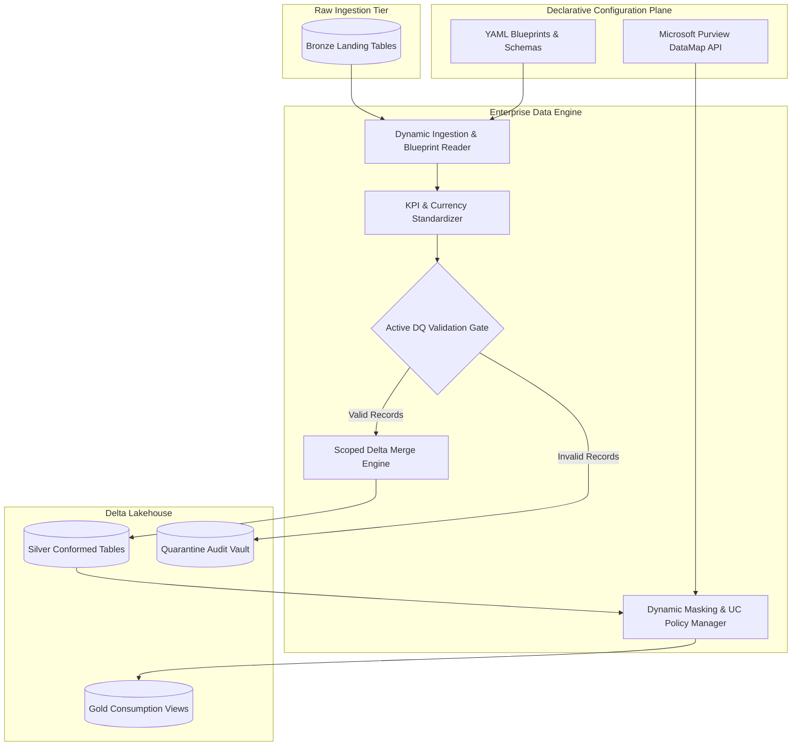

# Enterprise Data Engine

A production-grade, metadata-driven data platform framework built on **PySpark**, **Delta Lake**, and **Databricks Asset Bundles (DABs)**. Engineered to replace brittle, notebook-based workflows with modular software engineering practices: declarative configuration management, automated data quality quarantine routing, native Unity Catalog security policies, and zero-downtime CI/CD deployment gates.

---

## Key Capabilities

* **Metadata-Driven Ingestion & Modeling:** Decouples orchestration logic from dataset schemas. Tables, joins, derivations, and projections are declared via YAML blueprints.
* **Unified Scope-Aware Delta Merge Engine:** Standardizes `RELOAD`, `UPSERT`, and `APPEND` writes with partition-level scoping, schema conformance, and idempotency guarantees.
* **Active Quality Quarantine Gate:** Eliminates passive error logging by inspecting constraints against `system.information_schema` in a single pass. Automatically isolates invalid records into dedicated quarantine tables while routing clean data to target layers.
* **Automated Data Protection & Dynamic Masking:** Programmatically queries classification tags from Microsoft Purview, reconciles active masks across catalogs, and applies column-level encryption (`AES-256`) and dynamic role-based masks (`ALTER TABLE SET MASK`).
* **Automated Schema Lifecycle Waves:** Parses relational schema blueprints to orchestrate parallel DDL provisioning across priority waves (`Dimensions` $\rightarrow$ `Facts` $\rightarrow$ `Views`).
* **Shift-Left CI/CD Automation:** Multi-stage Azure Pipelines and local testing suites that enforce linting (`ruff`), configuration formatting (`pyproject-fmt`), unit testing (`pytest`), and bundle validation before production deployment.

---

## System Architecture


---

## Repository Layout
```text
enterprise-data-engine/
├── .azure-pipelines/
│   ├── enterprise-data-engine-build.yml
│   ├── enterprise-data-engine-pr.yml
│   ├── enterprise-data-engine-push.yml
│   ├── enterprise-data-engine-release-dev.yml
│   ├── enterprise-data-engine-release-prod.yml
│   └── enterprise-data-engine-release-uat.yml
├── .vscode/
│   ├── extensions.json
│   ├── launch.json
│   └── settings.json
├── documents/
├── resources/
│   ├── alerts/
│   │   └── sample.alerts.yml
│   ├── jobs/
│   │   ├── common_trigger_sample.jobs.yml
│   │   ├── job_compute_sample.jobs.yml
│   │   ├── manage_entities.jobs.yml
│   │   └── serverless_compute_sample.jobs.yml
│   ├── targets.yml
│   └── variables.yml
├── source/
│   └── data_engine/
│       ├── config/
│       │   ├── blueprints/
│       │   │   └── sample_rules.py
│       │   └── schemas/
│       │       ├── data_engine_dimensions.yml
│       │       ├── data_engine_facts.yml
│       │       └── data_engine_views.yml
│       ├── notebooks/
│       │   ├── orchestration/
│       │   │   ├── currency_conversion.ipynb
│       │   │   ├── manage_entities.ipynb
│       │   │   ├── sample_orchestration.ipynb
│       │   │   └── sample_snapshot.ipynb
│       │   └── utils/
│       │       └── setup_databricks_session.ipynb
│       ├── requirements/
│       │   ├── encryption.txt
│       │   └── log.txt
│       ├── src/
│       │   └── core/
│       │       ├── configs.py
│       │       ├── currency.py
│       │       ├── data_protection.py
│       │       ├── data_quality.py
│       │       ├── databricks_session.py
│       │       ├── engine.py
│       │       ├── helpers.py
│       │       └── version.py
│       ├── tests/
│       │   ├── conftest.py
│       │   ├── test_engine.py
│       │   └── test_quality.py
│       ├── pyproject.toml
│       ├── rebuild.cmd
│       └── run_gates.cmd
├── .gitignore
├── LICENSE
└── README.md
```

---

## Core Framework Modules
